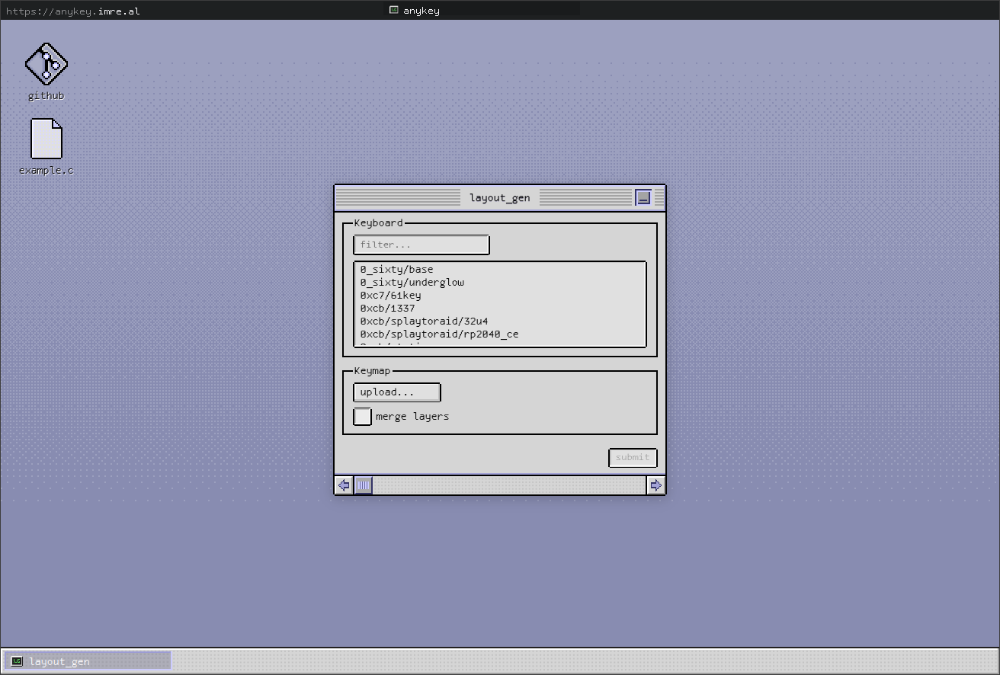
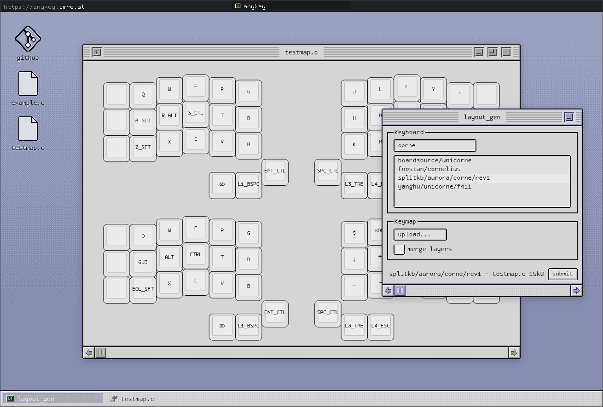

## [anykey](https://anykey.imre.al)
render graphical representations of [QMK](https://qmk.fm) .c keymaps (***png/jpeg/svg***)

- front: **svelte**
- back: **python (flask)**

#### screenshots

#### todo/known issues (no priority):
- **parser**
  - [ ] combos
  - [ ] tap holds
  - [ ] encoders/pointing devices
- **keymaps**
  - [ ] filter duplicate keyboards
  - [ ] keycap rotation
  - [ ] extend keyboard list for boards not in QMK master, e.g. [fingerpunch](https://github.com/sadekbaroudi/fingerpunch)
- **ui**
  - [ ] fit long key labels in key
  - [ ] make windows unable to be dragged off-screen
